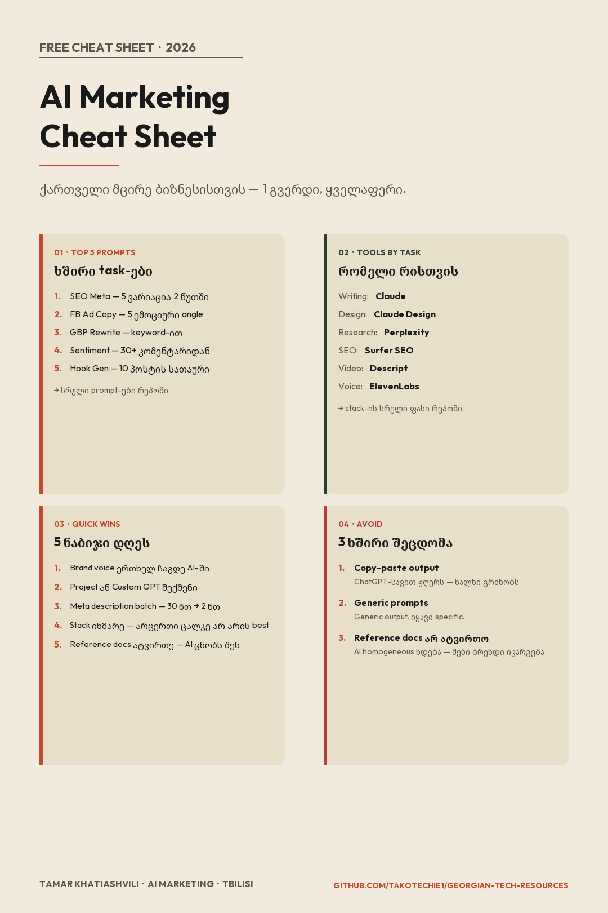

# AI Marketing Cheat Sheet — ერთი გვერდი

> ერთი დენსი reference card — ყველაფერი მთავარი ერთად. ტოპ prompt-ები, ხელსაწყოები, quick win-ები და ხშირი შეცდომები. ქართველი მცირე ბიზნესისთვის.

**ავტორი:** [TakoTechie1](https://github.com/TakoTechie1)
**ლიცენზია:** MIT — თავისუფლად გამოიყენე და გააზიარე
**ბოლო განახლება:** 2026

---

## 🖼️ Visual Cheat Sheet

> 💡 გადმოწერე ფოტო, შეინახე ტელეფონში — გამოიყენე როცა გადაწყვეტილების მიღება მოგიწევს.

---

## 📚 სარჩევი

- [01 — ტოპ 5 Prompt](#01--ტოპ-5-prompt)
- [02 — ხელსაწყოები Task-ის მიხედვით](#02--ხელსაწყოები-task-ის-მიხედვით)
- [03 — 5 Quick Win](#03--5-quick-win)
- [04 — 3 ხშირი შეცდომა, რომელსაც უნდა მოერიდო](#04--3-ხშირი-შეცდომა-რომელსაც-უნდა-მოერიდო)

---

## 01 — ტოპ 5 Prompt

ხშირი მარკეტინგ-task-ებისთვის. სრული prompt-ები იხილე — [5 AI Prompt ქართული მცირე ბიზნესისთვის](./5-ai-prompts-for-georgian-smb.md).

| # | Task | რას აკეთებს |
|:-:|------|-------------|
| 1 | **SEO Meta** | 5 ვარიაცია 2 წუთში — 30 წუთის სამუშაო |
| 2 | **FB Ad Copy** | 5 ემოციური angle (FOMO, social proof, ა.შ.) |
| 3 | **GBP Rewrite** | Google Business Profile keyword-ით |
| 4 | **Sentiment** | 30+ კომენტარიდან 5 ინსაიტი |
| 5 | **Hook Gen** | 10 პოსტის სათაური 5 ფორმატში |

---

## 02 — ხელსაწყოები Task-ის მიხედვით

ჩემი პირადი rotation. სრული შედარება ფასებით — [AI ხელსაწყოების Stack 2026](./tool-stack-2026.md).

| Task | ხელსაწყო |
|------|----------|
| **Writing** | Claude |
| **Design** | Claude Design |
| **Research** | Perplexity |
| **SEO** | Surfer SEO |
| **Video** | Descript |
| **Voice** | ElevenLabs |

> 💡 არცერთი ხელსაწყო არ არის ცალკე "best". მუშაობს stack-ი — სხვადასხვა task-ისთვის სხვადასხვა ხელსაწყო.

---

## 03 — 5 Quick Win

ნაბიჯები, რომლებიც შეგიძლია დღესვე გადადგა.

1. **Brand voice ერთხელ ჩაგდე AI-ში** — Claude Project, Custom GPT ან Style. ერთხელ setup → ყოველ ჩათში ცოცხალი output. იხილე [Claude Project Setup გაიდი](./claude-project-setup.md).

2. **შექმენი Project ან Custom GPT** — თითო კლიენტისთვის ან ბრენდისთვის. აღარ მოგიწევს ყოველ ჯერზე "შენ ხარ ქართული ბრენდი..." გამეორება.

3. **Meta description batch generation** — 30 წუთიანი ხელით სამუშაო → 2 წუთიანი AI workflow. იხილე [5 AI Prompt](./5-ai-prompts-for-georgian-smb.md).

4. **Stack იხმარე** — არცერთი ცალკე AI არ არის "საუკეთესო". Claude — ტექსტისთვის. ChatGPT — image-ისთვის. Perplexity — კვლევისთვის. სხვადასხვა task = სხვადასხვა ხელსაწყო.

5. **Reference docs ატვირთე** — brand guideline, customer personas, FAQ. AI ცნობს თქვენს ბრენდს მხოლოდ იმდენად, რამდენადაც მონაცემს მისცემთ.

---

## 04 — 3 ხშირი შეცდომა, რომელსაც უნდა მოერიდო

### 1. Pure copy-paste AI output

**პრობლემა:** AI-ის ტექსტი პირდაპირ post-ში — "ChatGPT-სავით ჟღერს". ხალხი ცნობს, ალგორითმიც.

**გამოსავალი:** AI-ის output ყოველთვის ხელით განახლდება. შენი ხმით, შენი ნიუანსით.

### 2. Generic prompts

**პრობლემა:** "დაწერე post ჩემი ბიზნესისთვის" → generic output, რომელიც ნებისმიერ ბიზნესს ჯდება.

**გამოსავალი:** იყავი specific. "დაწერე Instagram post ჩვენი specialty coffee brand-ისთვის ვაკეში, target audience 25-35 წლის კრეატიული პროფესიონალები, hook პირველ ხაზში, max 100 სიტყვა" — ეს უკვე გამოყენებად output-ს იძლევა.

### 3. Reference docs არ ატვირთო

**პრობლემა:** Project-ი ცარიელი, AI ჰომოგენური output-ს იძლევა. შენი ბრენდი იკარგება.

**გამოსავალი:** ატვირთე brand guideline, customer personas, top 10 reviews, past best campaigns. რაც მეტი ცოცხალი მონაცემი, მით უფრო შენი ხმით ლაპარაკობს AI.

---

## 📖 დაკავშირებული რესურსები

- [5 AI Prompt ქართული მცირე ბიზნესისთვის](./5-ai-prompts-for-georgian-smb.md) — სრული prompt-ები
- [AI ხელსაწყოების Stack 2026](./tool-stack-2026.md) — სრული შედარება ფასებით
- [Claude Project Setup გაიდი](./claude-project-setup.md) — ბრენდის voice-ის automate
- [AI-მარკეტინგ Audit Checklist](./ai-marketing-audit-checklist.md) — სრული workflow-ის შემოწმება

---

### უკან [მარკეტერების სექციაზე](./README.md)  ·  [მთავარი რეპო](../README.md)

